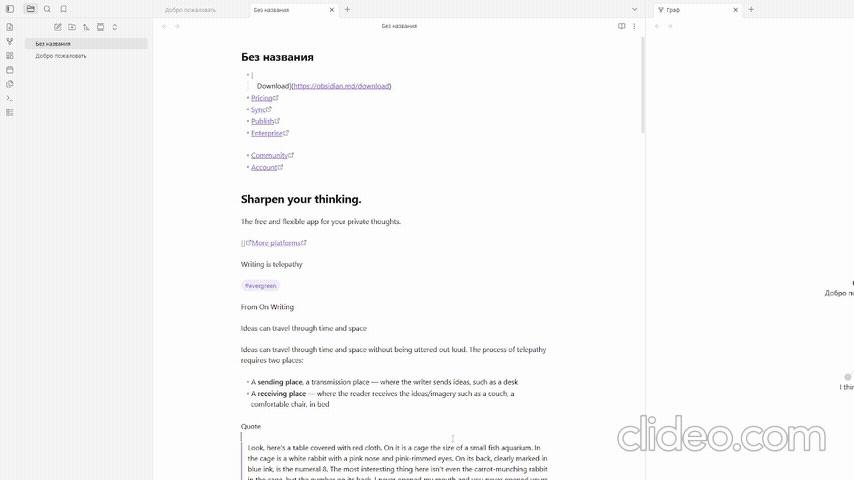

# Highlight Same Matches

An Obsidian plugin that automatically highlights every occurrence of your selected text throughout the current note — just like Notepad++ does.

## Demo

## How it works

Select any word or phrase and all matching text instantly lights up with a golden highlight. Deselect — and the highlights vanish. No commands, no hotkeys, no configuration. It just works.

- Real-time highlighting on selection change or text editing
- Ignores single characters and whitespace to keep things clean
- Highlights update live as you edit the document

## Installation

### From Community Plugins

1. Open Obsidian Settings → Community Plugins;
2. Search for **Highlight Same Matches**;
3. Install and enable the plugin;

### Manual

1. Clone this repository into your vault's `.obsidian/plugins/` directory
2. Rebuild or copy the built `main.js`, `styles.css`, and `manifest.json` into the plugin folder
3. Enable the plugin in Obsidian Settings → Community Plugins

## License

[MIT](LICENSE)
